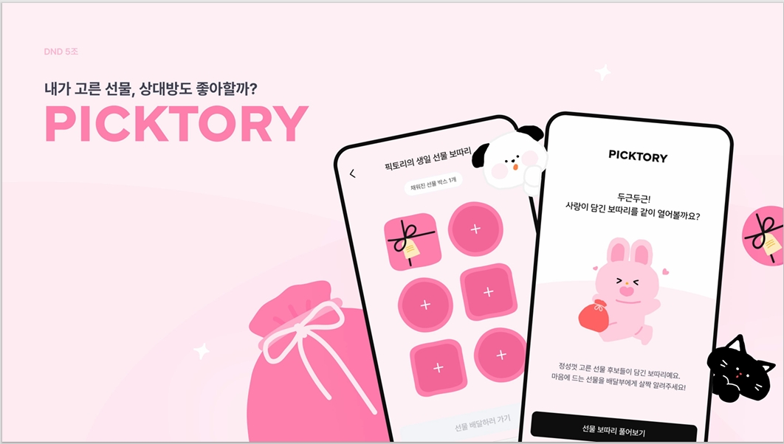
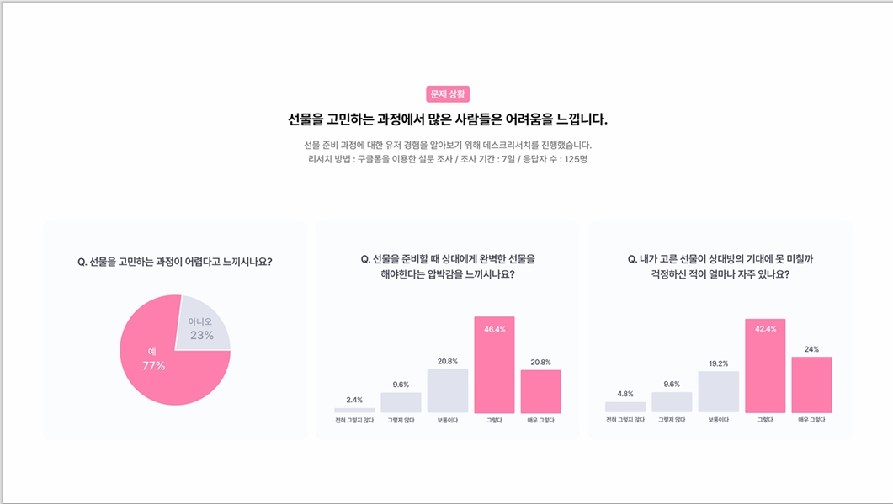
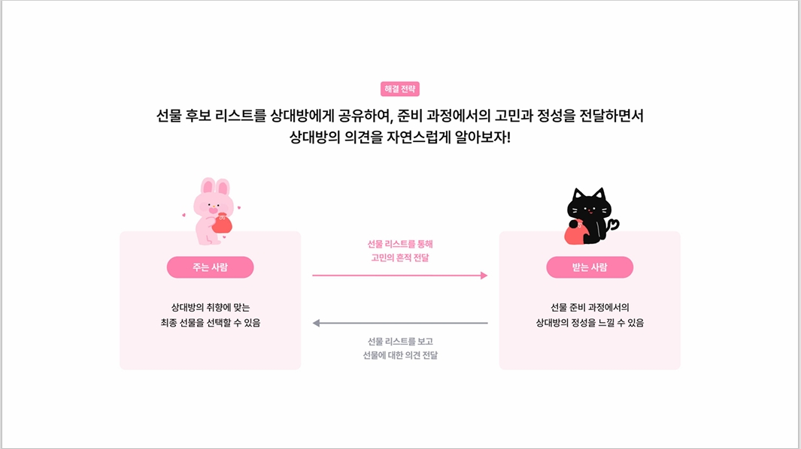
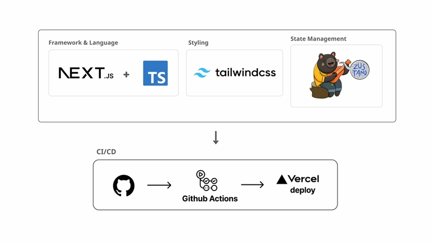
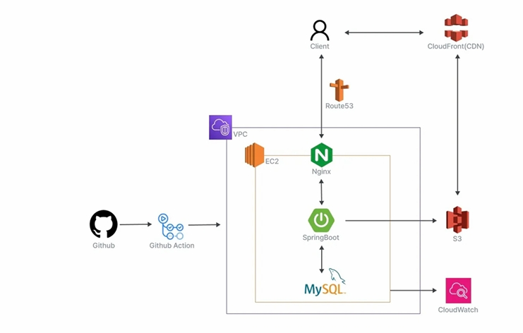

# 🎁 Picktory

<div align="center">
    
    <h3>선물의 의미는 유지하면서, 상대방의 취향을 자연스럽게 알 수 있는 서비스</h3>
</div>

<div align="center">
    <a href="https://www.picktory.net/">📍 Live Demo: www.picktory.net</a>
</div>

## 📑 목차
- [💡 서비스 소개](#-서비스-소개)
- [🛠️ 기술 스택](#️-기술-스택)
- [🧩 주요 기능](#-주요-기능)
- [🏗️ 시스템 아키텍처](#️-시스템-아키텍처)
- [🧪 개발 프로세스](#-개발-프로세스)
- [🚀 설치 및 실행 방법](#-설치-및-실행-방법)
- [🌟 내가 수행한 주요 개발 이력](#-내가-수행한-주요-개발-이력)
- [🔍 사용자 흐름도](#-사용자-흐름도)

## 💡 서비스 소개

### 배경 및 문제 의식


선물 고르기는 많은 사람들에게 어려운 과제입니다. 125명의 설문 결과, 사람들이 상대방의 선호도를 직접 물어보지 못하는 가장 큰 이유는 **'선물의 감성이 사라지고 성의가 없어 보일까봐'**였습니다.

### 해결책: Picktory


Picktory는 다음과 같은 솔루션을 제공합니다:

- **선물 후보 공유**: 여러 선물 옵션을 한 번에 공유하여 상대방의 의견을 자연스럽게 수집
- **준비 과정 공유**: 선물 선택 과정의 고민과 노력을 함께 전달하여 정성을 표현
- **선물의 의미 유지**: 깜짝 선물의 설렘을 유지하면서도 효과적인 선물 선택 가능
- **유연한 답변 시스템**: 받는 사람이 자유롭게 선물에 반응하고 의견을 남길 수 있음

### 서비스 차별점
- **보따리 개념**: 여러 선물 옵션을 하나의 보따리에 담아 전달하는 특별한 경험
- **캐릭터 배달부**: 귀여운 캐릭터가 보따리를 배달하는 재미 요소 추가
- **간편한 링크 공유**: 고유 링크로 쉽게 보따리 공유 가능
- **상태 관리 시스템**: DRAFT → PUBLISHED → COMPLETED 상태 흐름으로 효율적인 과정 관리

## 🛠️ 기술 스택

### Backend


### DevOps & Tools


## 🧩 주요 기능

### 1. 인증 시스템
- **카카오 소셜 로그인**: 간편한 로그인 및 회원가입 통합 프로세스
- **JWT 기반 인증**: 안전한 토큰 관리 및 재발급 시스템
- **유저 관리**: 회원 정보 조회, 로그아웃, 탈퇴 기능

### 2. 보따리 관리
- **생성 및 편집**: 다양한 디자인의 보따리 생성 및 편집 기능
- **선물 관리**: 선물 추가, 수정, 삭제 및 이미지 업로드
- **배달 설정**: 다양한 캐릭터로 보따리 배달 설정 기능
- **고유 링크**: UUID 기반 공유 링크 생성

### 3. 응답 시스템
- **보따리 열람**: 링크를 통한 보따리 접근 및 열람
- **선물 응답**: 다양한 태그를 통한 선물 응답 기능
- **결과 조회**: 보따리 주인의 응답 결과 조회 기능
- **읽음 표시**: 응답 확인 상태 표시 기능

### 4. 파일 관리
- **AWS S3 통합**: 이미지 저장 및 관리 시스템
- **썸네일 처리**: 자동 썸네일 생성 및 관리

## 🏗️ 시스템 아키텍처

### Frontend Architecture


### Backend Architecture


## 🧪 개발 프로세스

### 1. 코드 관리 전략
- **브랜치 전략**:
   - `main`: 제품 배포를 위한 기준 브랜치
   - `develop`: 개발 통합 브랜치
   - `feature/<기능명>`: 기능 개발 브랜치

### 2. PR(Pull Request) 프로세스
- **Pull Request 규칙**:
   - 직접 `Push` 금지: 모든 코드 변경은 PR을 통해 진행
   - PR 공유: 팀 내 공유 필수

### 3. 커밋 컨벤션
- **커밋 메시지 구조**: `[<타입>]: <작업내용>`
- **커밋 타입**:
   - `feat`: 새로운 기능 구현
   - `fix`: 버그 해결
   - `refactor`: 코드 리팩터링
   - `docs`: 문서 수정
   - `style`: 코드 스타일 변경
   - `test`: 테스트 코드 관련

## 🚀 설치 및 실행 방법

### 요구사항
- JDK 17+
- MySQL 8.0+
- Gradle

### 설치 및 실행 단계
1. 레포지토리 클론
```bash
git clone https://github.com/dnd-side-project/dnd-12th-5-backend.git
cd dnd-12th-5-backend
```

2. 애플리케이션 빌드
```bash
./gradlew build
```

3. 애플리케이션 실행
```bash
./gradlew bootRun
```

4. API 문서 접근
```
http://localhost:8080/swagger-ui.html
```

## 🌟 내가 수행한 주요 개발 이력

### 1. 기본 인프라 구축

#### 1.1. Swagger 초기 설정 : [](https://github.com/dnd-side-project/dnd-12th-5-backend/pull/3)

```gradle
implementation 'org.springdoc:springdoc-openapi-starter-webmvc-ui:2.3.0'
```

**구현 내용**
- ✨ API 문서화를 위한 SwaggerConfig 클래스 생성
- 🛠️ Context path를 `/api/v1`로 설정
- 📝 Swagger UI path: `/swagger-ui.html`
- 📚 API docs path: `/v3/api-docs`

#### 1.2. QueryDSL 환경 구성 : [](https://github.com/dnd-side-project/dnd-12th-5-backend/pull/4)

```gradle
implementation 'com.querydsl:querydsl-jpa:5.0.0:jakarta'
annotationProcessor "com.querydsl:querydsl-apt:5.0.0:jakarta"
```

**구현 내용**
- ⚙️ JPAQueryFactory Bean 등록
- 🔄 Q클래스 자동 생성 설정
- 📝 Entity 변경 시 clean & rebuild 필요

#### 1.3. Spring Security 기본 설정 : [](https://github.com/dnd-side-project/dnd-12th-5-backend/pull/5)

**구현 내용**
- 🔐 JWT 인증 필터 구현
- 🛡️ API 엔드포인트별 접근 권한 설정
- 🌐 CORS 설정
   - 프론트엔드 도메인 설정 이후 보안 강화 예정
   - HTTP 메소드: GET, POST, PUT, DELETE, OPTIONS

### 2. 인증 시스템 개발

#### 2.1. JWT 토큰 관리 시스템 구현 : [](https://github.com/dnd-side-project/dnd-12th-5-backend/pull/7)

**구현 내용**
- ✅ 토큰 유효성 검증 로직
- 🔄 만료 토큰 재발급 기능
- 🔒 토큰 서명 및 암호화 처리
- 🛠️ 사용자 ID 기반 클레임 설계

#### 2.2. JWT 인증 및 보안 아키텍처 개선 : [](https://github.com/dnd-side-project/dnd-12th-5-backend/pull/68)

**구현 내용**
- 🔒 SecurityConfig 클래스 전면 리팩토링
- 🛡️ JWT 인증 아키텍처 재설계 및 최적화
- 🌐 인증 필터 체인 개선 및 고도화
- 🔑 권한 검증 로직 강화
- 🛠️ 엔드포인트별 세분화된 접근 제어 구현
- 🔄 인증 예외 처리 흐름 개선

#### 2.3. 카카오 OAuth 인증 시스템 구축 : [](https://github.com/dnd-side-project/dnd-12th-5-backend/pull/8)

**OAuth 인증 플로우**
1. 🎫 인증 코드로 카카오 액세스 토큰 발급
2. 👤 카카오 사용자 정보 조회
3. 🔑 JWT 토큰 발급

**회원 관리 기능**
- 📝 회원가입/로그인 통합 프로세스
- 👤 내 정보 조회
- 🚪 로그아웃
- ❌ 회원 탈퇴 (카카오 연동 해제 포함)

#### 2.3. 카카오 로그인 테스트 환경 구축 : [](https://github.com/dnd-side-project/dnd-12th-5-backend/pull/9)

**구현 내용**
- 🧹 DatabaseCleaner 구현
- ✅ JUnit 5 BeforeEachCallback 활용
- 🔒 SecurityContextHolder를 활용한 인증 테스트

#### 2.4. 인증 관련 예외 처리 통일 : [](https://github.com/dnd-side-project/dnd-12th-5-backend/pull/73)

**구현 내용**
- 🔄 인증 관련 예외를 BaseException으로 통일
- 🛠️ 에러 응답을 BaseResponseStatus 열거형으로 표준화
- 📝 토큰 만료 예외 처리 로직 개선
- 🌐 에러 메시지 한글화 및 일관성 유지

#### 2.5. JWT 토큰 관리 개선 : [](https://github.com/dnd-side-project/dnd-12th-5-backend/pull/104)

**구현 내용**
- ✨ TokenDto에 refreshTokenExpiresIn 필드 추가
- 🛠️ 리프레시 토큰에 userId 정보 포함
- 🔄 RefreshTokenService에서 토큰 업데이트 로직 수정
- 📝 API 명세서와 실제 구현 일치화

#### 2.6. 회원 탈퇴 후 재가입 오류 해결 : [](https://github.com/dnd-side-project/dnd-12th-5-backend/pull/111)

**구현 내용**
- 🔄 User 엔티티에 reactivate() 메서드 추가
- 🛠️ AuthService에서 탈퇴 사용자 재활성화 로직 구현
- 📝 회원 탈퇴 및 재가입 정책 개선
- 👥 서비스 접근성 향상

### 3. 핵심 기능 개발

#### 3.1. 배달부 캐릭터 선택 시스템 : [](https://github.com/dnd-side-project/dnd-12th-5-backend/pull/24)

**구현 내용**
- 🎨 배달부 캐릭터 설정 API
- 🔗 고유 링크 생성 통합
- 📦 Bundle 상태 관리 개선:
   1. `DRAFT` (초기)
   2. `PUBLISHED` (배달부 설정 & 링크 생성)

#### 3.2. 보따리 통합 조회 기능 : [](https://github.com/dnd-side-project/dnd-12th-5-backend/pull/28)

**구현 내용**
- 🔍 QueryDSL 기반 데이터 조회
- 🎁 선물, 이미지, 응답 정보 통합 조회
- ✨ Response 엔티티 구현
- 🛠️ QueryDSL 기반 커스텀 구현체

#### 3.3. 보따리 답변 시스템 구현 : [](https://github.com/dnd-side-project/dnd-12th-5-backend/pull/35)

**구현 내용**
- 🏷️ GiftResponseTag 관리 체계
- 📝 다중 선물 답변 처리
- ✅ 상태 검증:
   - 번들 상태
   - 선물 목록
   - 기존 응답 여부
   - 응답 완료 여부

#### 3.4. 보따리 상세 조회 기능 : [](https://github.com/dnd-side-project/dnd-12th-5-backend/pull/44)

**구현 내용**
- 🎁 개별 선물 상세 정보 조회
- 🖼️ 썸네일 및 이미지 목록 분리
- 🔒 권한 검증 및 예외 처리

#### 3.5. 보따리 작성 완료 기능 : [](https://github.com/dnd-side-project/dnd-12th-5-backend/pull/45)

**구현 내용**
- 📝 DRAFT 상태 보따리 조회
- ⚡ N+1 문제 해결을 위한 벌크 조회
- 🖼️ 이미지 처리:
   - 썸네일 분리
   - 이미지 목록 매핑

#### 3.6. 선물 답변 결과 조회 API : [](https://github.com/dnd-side-project/dnd-12th-5-backend/pull/98)

**구현 내용**
- 🆕 링크 기반 선물 응답 결과 조회 API 추가
- 🔓 로그인 없이 보따리 링크로 결과 조회 가능
- 🔒 COMPLETED 상태인 보따리만 조회 가능하도록 제한
- 📦 선물 이름, 썸네일, 구매 링크, 응답 태그 반환 구현

#### 3.7. 보따리 이름 수정 API : [](https://github.com/dnd-side-project/dnd-12th-5-backend/pull/106)

**구현 내용**
- 🆕 PATCH API 구현으로 효율성 개선
- 📝 BundleNameUpdateRequest DTO 생성
- 🛠️ 보따리 이름만 수정하기 위한 별도 API 분리
- 🔒 DRAFT 상태에서만 이름 수정 가능하도록 제한

### 4. 개선 및 버그 수정

#### 4.1. JWT 토큰 시스템 심층 리팩토링

##### 4.1.1. JWT 토큰 아키텍처 개선 : [](https://github.com/dnd-side-project/dnd-12th-5-backend/pull/101)

**구현 내용**
- 🔄 TokenDto 구조 전면 개편 및 표준화
- 🔐 토큰 클레임 데이터 구조 최적화
- 🛠️ 토큰 생성/검증 흐름 개선으로 안정성 증가
- 📝 API 명세서와의 불일치 해소

##### 4.1.2. JWT 필터 및 응답 태그 개선 : [](https://github.com/dnd-side-project/dnd-12th-5-backend/pull/86)

**구현 내용**
- 🔒 JWT 필터에 선물 응답 API 경로 추가
- 🏷️ 변경된 UI에 맞춰 GiftResponseTag enum 값 업데이트
- 🛠️ "정말 최고에요" 태그 추가
- 🐛 403 Forbidden 오류 해결

##### 4.1.3. 리프레시 토큰 저장소 최적화 : [](https://github.com/dnd-side-project/dnd-12th-5-backend/pull/102)

**구현 내용**
- 🔄 RefreshTokenRepository 구현체 최적화
- 🗄️ 토큰 저장 및 검색 성능 개선
- 🔍 토큰 조회 메서드 효율화
- 🐛 토큰 중복 저장 버그 수정

##### 4.1.4. 리프레시 토큰 에러 로깅 개선 : [](https://github.com/dnd-side-project/dnd-12th-5-backend/pull/90)

**구현 내용**
- 📊 토큰 관련 에러 로깅 시스템 구축
- 🔍 디버깅 가능성 향상
- 🐛 리프레시 토큰 에러 원인 추적 용이
- 📝 개발 및 운영 환경에서의 문제 해결 지원

##### 4.1.5. 토큰 만료 시간 설정 최적화 : [](https://github.com/dnd-side-project/dnd-12th-5-backend/pull/109)

**구현 내용**
- ⏱️ 액세스 토큰 및 리프레시 토큰 적정 시간 설정
- 🔄 세션 관리 최적화
- 🛠️ 사용자 로그인 상태 유지 개선
- 🔒 토큰 보안성 강화

#### 4.2. 보따리 및 UI 개선

##### 4.2.1. 보따리 디자인 시스템 개선 : [](https://github.com/dnd-side-project/dnd-12th-5-backend/pull/47)

**구현 내용**
- 🎨 design_type 필드 추가
- 🖌️ 배달부 SVG 변경을 위한 색상 정보 제공

##### 4.2.2. 이미지 처리 로직 개선 : [](https://github.com/dnd-side-project/dnd-12th-5-backend/pull/56)

**구현 내용**
- 🏞️ 첫 번째 이미지를 썸네일로 사용
- 🔄 이미지 URL 처리 방식 통일
- 📝 API 응답 형식 일관성 확보

##### 4.2.3. 보따리 식별자 시스템 개선 : [](https://github.com/dnd-side-project/dnd-12th-5-backend/pull/57)

**구현 내용**
- 🆔 보따리 조회 API 응답에 ID 포함
- 🔄 답변 저장 API 연동 개선

#### 4.3. API 보안 및 호환성 개선

##### 4.3.1. PATCH 메소드 CORS 설정 : [](https://github.com/dnd-side-project/dnd-12th-5-backend/pull/107)

**구현 내용**
- 🔒 SecurityConfig에 PATCH 메소드 허용 설정 추가
- 🛠️ CORS 관련 설정 보강
- 🐛 보따리 이름 수정 API 403 에러 해결
- 🌐 프론트엔드와의 원활한 통신 지원

##### 4.3.2. Bundle 최소 선물 개수 요구사항 변경 : [](https://github.com/dnd-side-project/dnd-12th-5-backend/pull/105)

**구현 내용**
- 🔄 선물 최소 개수 요구사항을 1개로 변경
- 🛠️ BundleRequest DTO 검증 로직 수정
- 📝 유효성 검사 메시지 업데이트
- 👥 사용자 경험 개선

#### 4.4. 테스트 코드 안정성 향상

##### 4.4.1. 카카오 클라이언트 테스트 개선 : [](https://github.com/dnd-side-project/dnd-12th-5-backend/pull/97)

**구현 내용**
- 🔄 예외 타입을 IllegalStateException에서 BaseException으로 변경
- 🛠️ 테스트 로직과 실제 구현 일치화
- ✅ BaseResponseStatus 검증 로직 추가
- 🐛 테스트 실패 문제 해결

##### 4.4.2. 답변 저장 테스트 수정 : [](https://github.com/dnd-side-project/dnd-12th-5-backend/pull/96)

**구현 내용**
- 🔄 ResponseServiceTest 클래스 수정
- 🛠️ Bundle 엔티티와 테스트 코드 사이의 불일치 해결
- ✅ 레포지토리 메소드 이름 일치화
- 🐛 테스트 실패 원인 해결

#### 4.5. 코드 품질 및 유지보수성 개선

##### 4.5.1. 네이밍 컨벤션 표준화 : [](https://github.com/dnd-side-project/dnd-12th-5-backend/pull/100)

**구현 내용**
- 🔄 스네이크 케이스에서 카멜 케이스로 변경
- 🛠️ Java 코드 스타일 컨벤션 적용
- 📝 일관된 코드 스타일 정착
- 🐛 네이밍으로 인한 오류 수정

##### 4.5.2. ResponseBundleDto 필드 네이밍 개선 : [](https://github.com/dnd-side-project/dnd-12th-5-backend/pull/87)

**구현 내용**
- 🔄 `delivery_character_type` → `deliveryCharacterType` 등으로 변환
- 🛠️ Java 네이밍 컨벤션 준수
- 📝 프론트엔드와의 인터페이스 일관성 유지
- 🧰 코드 가독성 향상

##### 4.5.3. SaveGiftResponsesRequest 검증 로직 분리 : [](https://github.com/dnd-side-project/dnd-12th-5-backend/pull/88)

**구현 내용**
- 🔄 bundleId와 링크(UUID)의 개념 명확히 분리
- 🛠️ API 요청 및 서비스 로직 개선
- 📝 검증 로직 분리로 코드 품질 향상
- 🧰 유지보수성 개선

## 🔍 감사합니다.

